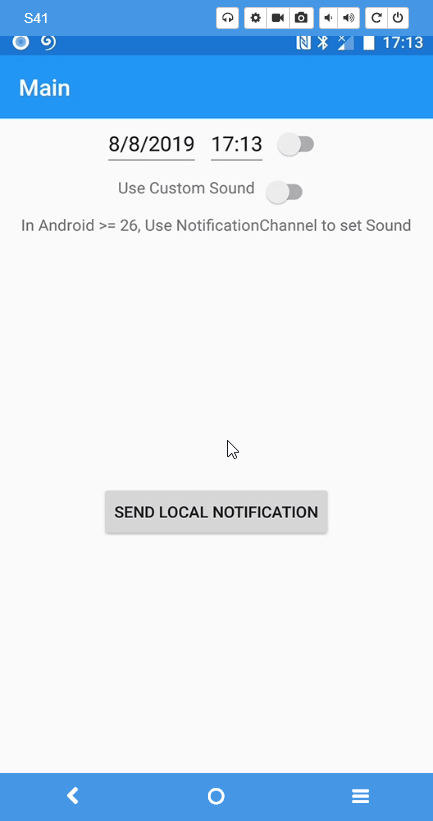

[](https://ci.appveyor.com/project/tmt242001/plugin-localnotification)

[](https://www.nuget.org/packages/Plugin.LocalNotification/)


# 3.0.2 Documentation

- Please go to [3.0.2 Documentation](../../wiki/Usage-3.0.2), if you are referencing a version below 4.0.0. 
- Version 4.* has setup differences in Android if upgrading from version 3.*

# 2.0.7 Documentation

- Please go to [2.0.7 Documentation](../../wiki/Usage-2.0.7), if you are referencing a version below 3.0.0. 
- Version 3.* has breaking changes if upgrading from version 2.*

# Plugin.LocalNotification
The local notification plugin provides a way to show local notifications from Xamarin.Forms apps.

# Setup

- `Plugin.LocalNotification` Available on NuGet: https://www.nuget.org/packages/Plugin.LocalNotification
- Install into your platform-specific projects (iOS/Android), and any .NET Standard 2.0 projects required for your app.

## Platform Support

|Platform|Supported|Version|Notes|
| ------------------- | :-----------: | :------------------: | :------------------: |
|Xamarin.iOS|Yes|iOS 10+| |
|Xamarin.Android|Yes|API 14+|Project should [target Android framework 9.0+](https://docs.microsoft.com/en-us/xamarin/android/app-fundamentals/android-api-levels?tabs=vswin#framework)|

# Usage

### Show local notification

```csharp
var notification = new NotificationRequest
{
    NotificationId = 100,
    Title = "Test",
    Description = "Test Description",
    ReturningData = "Dummy data", // Returning data when tapped on notification.
    NotifyTime = DateTime.Now.AddSeconds(30) // Used for Scheduling local notification, if not specified notification will show immediately.
};
NotificationCenter.Current.Show(notification);
```

### Receive local notification tap event

```csharp
public partial class App : Application
{
	public App()
	{
		InitializeComponent();

		// Local Notification tap event listener
		NotificationCenter.Current.NotificationTapped += OnLocalNotificationTapped;

		MainPage = new MainPage();
	}
	
	private void OnLocalNotificationTapped(LocalNotificationTappedEvent e)
    	{
		// your code goes here
	}
}
```

# Platform Specific Notes

### Android

Project should [target Android framework 9.0+](https://docs.microsoft.com/en-us/xamarin/android/app-fundamentals/android-api-levels?tabs=vswin#framework)


Scheduled local notifications will persist after device reboot, if permission is set and SDK more than 5.0 Lollipop (API 21). **You only need to do this if you plugin verion is below 4.0.3**

```XML
<uses-permission android:name="android.permission.RECEIVE_BOOT_COMPLETED" />
```

#### Setup

To receive Local Notification tap event.
Include the following code in the OnNewIntent() method of MainActivity:

```csharp
public class MainActivity : global::Xamarin.Forms.Platform.Android.FormsAppCompatActivity
{
	protected override void OnCreate(Bundle savedInstanceState)
	{
	        .....
	        // Must create a Notification Channel when API >= 26
                // you can created multiple Notification Channels with different names.
                NotificationCenter.CreateNotificationChannel();		
		.....		
		LoadApplication(new App());
		.....	
		NotificationCenter.NotifyNotificationTapped(Intent);
	}

	protected override void OnNewIntent(Intent intent)
	{
		NotificationCenter.NotifyNotificationTapped(intent);
		base.OnNewIntent(intent);
	}
}
```

### iOS

#### Setup

You must get permission from the user to allow the app to show local notifications.
Also, To receive Local Notification tap event.
Include the following code in the FinishedLaunching() method of AppDelegate:

```csharp
public partial class AppDelegate : global::Xamarin.Forms.Platform.iOS.FormsApplicationDelegate
{        
	public override void WillEnterForeground(UIApplication uiApplication)
        {
            Plugin.LocalNotification.NotificationCenter.ResetApplicationIconBadgeNumber(uiApplication);
        }
}
```
# Screen Record



# Notification Channels

[Setting up Notification Channels](../../wiki/%5BAndroid---=-26%5D-Notification-Channel)

# Custom Sound

[Notification with a Sound-File](../../wiki/Notification-with-a-Sound-File)

# SourceLink Support

In Visual Studio, confirm that SourceLink is enabled. 
Also, Turn off "Just My Code" since, well, this isn't your code.

https://docs.microsoft.com/en-us/dotnet/standard/library-guidance/sourcelink

# Limitations

Only support <b>iOS</b> and <b>Android</b> for the moment. 

# Contributing

Contributions are welcome.  Feel free to file issues and pull requests on the repo and they'll be reviewed as time permits.

## Icon and Sound

- Thank you for the Icons by [DinosoftLabs](https://www.iconfinder.com/dinosoftlabs) and [Iconic Hub](https://www.iconfinder.com/iconic_hub) 
- Thank you for the sound file by [Notification sounds](https://notificationsounds.com/notification-sounds/good-things-happen-547)
