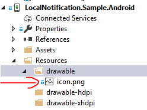

# Plugin.LocalNotification
The local notification plugin provides a way to show local notifications from Xamarin.Forms apps.

# Setup

- `Plugin.LocalNotification` Available on NuGet: https://www.nuget.org/packages/Plugin.LocalNotification
- Install into your platform-specific projects (iOS/Android), and any .NET Standard 2.0 projects required for your app.

## Platform Support

|Platform|Supported|Version|Notes|
| ------------------- | :-----------: | :------------------: | :------------------: |
|Xamarin.iOS|Yes|iOS 7+| |
|Xamarin.Android|Yes|API 16+|Project should [target Android framework 8.1+](https://docs.microsoft.com/en-us/xamarin/android/app-fundamentals/android-api-levels?tabs=vswin#framework)|

# Usage

## Send local notification

```csharp
var notificationService = DependencyService.Get<ILocalNotificationService>();
var notification = new Plugin.LocalNotification.LocalNotification
{
    NotificationId = 100,
    Title = "Test",
    Description = "Test Description"
};
notificationService.Send(notification);
```

## Cancel a local notification

```csharp
var notificationService = DependencyService.Get<ILocalNotificationService>();
notificationService.Cancel(100);
```

## Receive local notification tap event

```csharp
public partial class App : Application
{
	public App()
	{
		InitializeComponent();

		// Local Notification tap event listener
		MessagingCenter.Instance.Subscribe<LocalNotificationTappedEvent>(this,
			typeof(LocalNotificationTappedEvent).FullName, OnLocalNotificationTapped);

		MainPage = new MainPage();
	}
	
	private void OnLocalNotificationTapped(LocalNotificationTappedEvent e)
    {
		// your code goes here
	}
}
```

# Platform Specific Notes

### Android

Notification Icon must be set for notification to appear. 

You can set the notification Icon by setting the following property from inside your Android project:

```csharp
LocalNotificationService.NotificationIconId = Resource.Drawable.YOU_ICON_HERE
```

or

By adding icon.png to Resources\drawable



##### Setup

To receive Local Notification tap event.
Include the following code in the OnNewIntent() method of MainActivity:

```csharp
public class MainActivity : global::Xamarin.Forms.Platform.Android.FormsAppCompatActivity
{
	protected override void OnNewIntent(Intent intent)
	{
		LocalNotificationService.NotifyNotificationTapped(intent);
		base.OnNewIntent(intent);
	}
}
```

### iOS

##### Setup

You must get permission from the user to allow the app to show local notifications.
Also, To receive Local Notification tap event.
Include the following code in the FinishedLaunching() method of AppDelegate:

```csharp
public partial class AppDelegate : global::Xamarin.Forms.Platform.iOS.FormsApplicationDelegate
{        
	public override bool FinishedLaunching(UIApplication app, NSDictionary options)
	{
		global::Xamarin.Forms.Forms.Init();

		LocalNotificationService.SetupLocalNotification();

		LoadApplication(new App());
		
		.....
	}
}
```


# Limitations

Only support iOS and Android for the moment. 

# Contributing

Contributions are welcome.  Feel free to file issues and pull requests on the repo and they'll be reviewed as time permits.

## Icon

Thank you for the Icon by DinosoftLabs (https://www.iconfinder.com/dinosoftlabs)